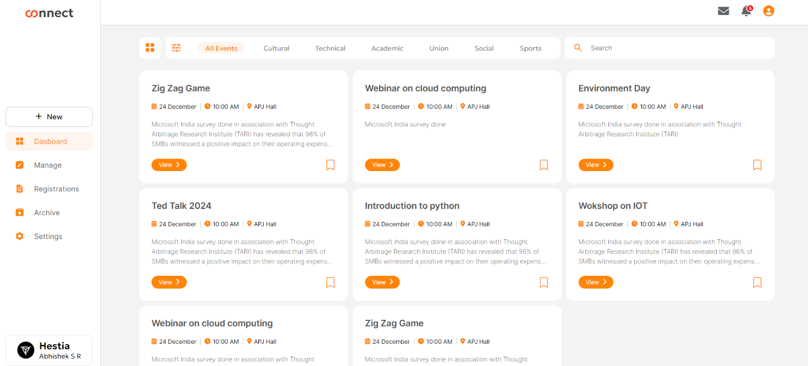
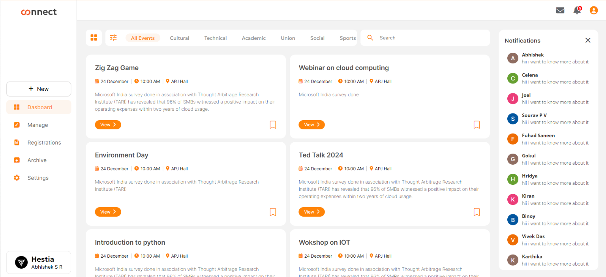
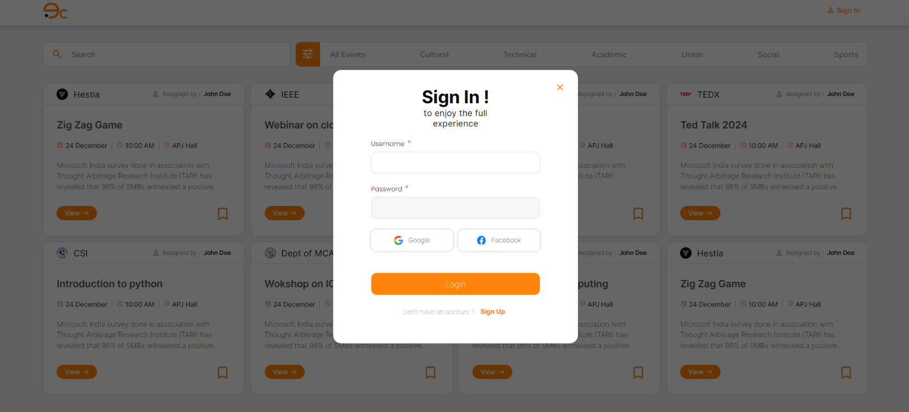
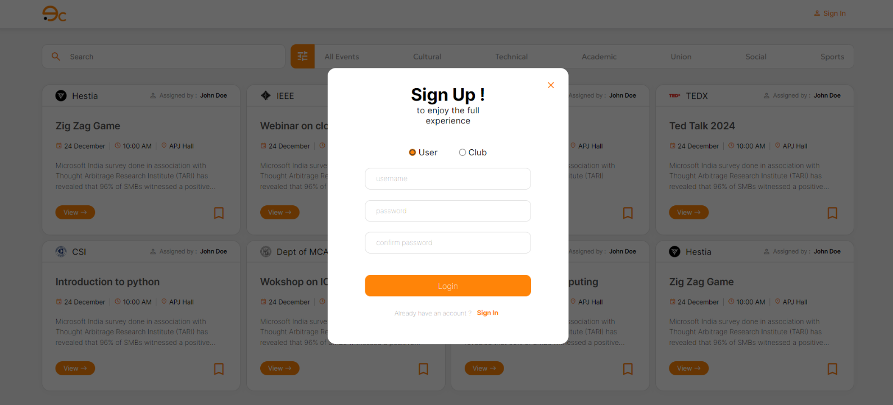
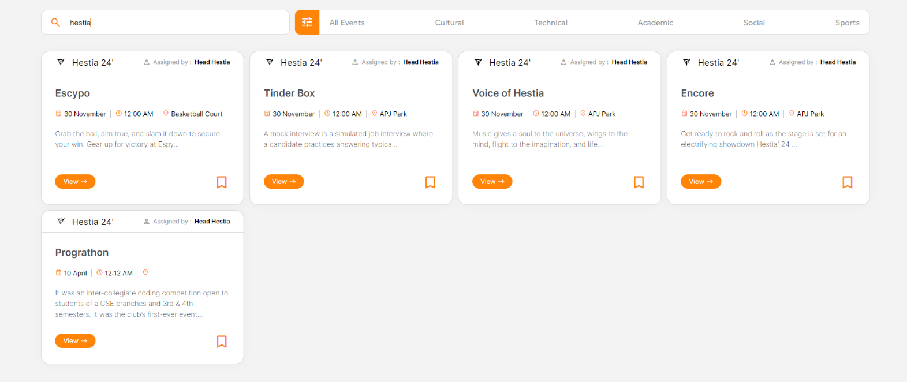

# EventsConnect

## Overview
**EventsConnect** is a centralized online platform designed to streamline the management of student-organized events in colleges. It enhances communication and collaboration among students, faculty, and staff, ultimately improving student engagement and enriching the college experience. 

The project also supports future expansion to facilitate collaboration with external organizations.

---

## Features
- Centralized event management system for colleges.
- Real-time updates and seamless communication.
- User-friendly, responsive, and mobile-friendly design.
- Scalable architecture to adapt to evolving college needs.

---

## Technologies Used
### Front-End
1. **HTML5**: 
   - Structures web pages with semantic elements to enhance accessibility.
2. **CSS**: 
   - Provides a responsive and mobile-friendly user interface.
3. **JavaScript**: 
   - Powers interactive elements and ensures efficient DOM manipulation.
4. **AJAX**: 
   - Enables asynchronous data exchange for real-time updates without reloading the page.

### Back-End
1. **PHP**: 
   - Implements server-side functionality to handle complex logic and data processing.
2. **MySQL**: 
   - Manages relational database operations for reliable data storage and retrieval.

---

### Homepage


### Notification


### Sign In


### Sign Up


### Live Search



## Project Scope
- Development of a web-based platform for college event management.
- Facilitates collaboration between students, faculty, and external organizations.
- Ensures a robust, scalable system adaptable to future requirements.

---

## Installation
1. Clone the repository:
   ```bash
   git clone https://github.com/yourusername/eventsconnect.git
